# KidCare

## Yêu cầu

- Git, Node.js 20, npm và Docker với Docker Compose.

## Chạy lần đầu

```bash
git clone <repository-url>
cd KidCare
docker compose up -d db
```

Trong terminal backend:

```bash
cd backend
cp .env.example .env
npm ci
npm run migration:run
npm run start:dev
```

Trong terminal frontend:

```bash
cd frontend
npm ci
npm run dev
```

Mở <http://localhost:5173>, Swagger tại <http://localhost:3000/docs>, liveness tại <http://localhost:3000/health> và trạng thái DB tại <http://localhost:3000/health/ready>.

Trên Windows PowerShell, thay `cp backend/.env.example backend/.env` bằng `Copy-Item backend/.env.example backend/.env` nếu cần. `backend/.env` chỉ dành cho máy cá nhân, không commit.

## Cấu trúc

- `backend/`: NestJS API, TypeORM, cấu hình và migrations PostgreSQL.
- `frontend/`: React + Vite.
- `docker-compose.yml`: PostgreSQL 16 với volume bền vững `pgdata`.
- `.github/workflows/ci.yml`: kiểm tra backend, frontend và Docker trên pull request vào `main`.

## Luồng tổng quát frontend và backend

```mermaid
flowchart LR
  User[Người dùng trên trình duyệt] --> UI[React UI]
  UI -->|HTTP fetch /api/...| Proxy[Proxy theo môi trường]
  Proxy -->|Bỏ tiền tố /api, chuyển tiếp| API[NestJS API :3000]
  API --> Router[Controller của module]
  Router --> Service[Service xử lý nghiệp vụ]
  Service --> Repo[TypeORM Repository<Entity>]
  Repo --> DS[DataSource trong DatabaseModule]
  DS --> PG[(PostgreSQL)]
  PG --> DS --> Repo --> Service --> Router --> API --> Proxy --> UI
```



Proxy phụ thuộc cách chạy ứng dụng:

- **Development:** Vite ở `frontend/vite.config.ts` nhận request `/api/...`, bỏ `/api` rồi chuyển tới `http://localhost:3000`. Ví dụ `/api/health` được gửi tới backend dưới đường dẫn `/health`.
- **Frontend chạy bằng Nginx:** `frontend/nginx.conf` chuyển tiếp `/api/...` tới backend. Cấu hình hiện tại dùng `host.docker.internal:3000`.

Ở backend, `main.ts` khởi tạo NestJS và Swagger. `AppModule` kết nối các module. Controller nhận HTTP request và trả response; với chức năng nghiệp vụ, controller gọi service, service dùng repository để đọc/ghi entity. Repository dùng `DataSource` do `DatabaseModule` cung cấp để giao tiếp PostgreSQL. Response đi ngược lại qua các lớp đó dưới dạng HTTP/JSON.

### Luồng đang chạy trong repo

Trang chủ React hiện gọi `GET /api/health`. Vite hoặc Nginx chuyển request tới `GET /health` của `HealthController`, rồi controller trả JSON trạng thái backend. `GET /health/ready` gọi `DataSource.query('SELECT 1')` để kiểm tra kết nối database.

`User` entity và repository đã được đăng ký trong `UsersModule`, nhưng hiện chưa có `UsersController` hay `UsersService` sử dụng repository. Vì vậy luồng controller → service → repository trong sơ đồ mô tả cách các chức năng nghiệp vụ nên được nối khi triển khai; chưa phải luồng CRUD User đã có.

### Migration và khởi động

Migration là luồng riêng, không chạy theo từng request: cập nhật entity → tạo migration → xem lại SQL → chạy `migration:run` để cập nhật schema PostgreSQL. Khi backend khởi động, `DatabaseModule` khởi tạo `DataSource`; nếu PostgreSQL không truy cập được thì backend không khởi động thành công.

## Database và migrations

Docker Compose chỉ khởi động DB: `docker compose up -d db`. Dữ liệu nằm trong volume `pgdata` và tồn tại khi container bị dừng hoặc tạo lại. Xóa volume bằng `docker compose down -v` sẽ xóa dữ liệu.

Tạo migration sau khi cập nhật entity:

```bash
cd backend
npm run migration:generate
npm run migration:run
```

Migration `InitialSchema` là baseline không tạo bảng. Migration `Schema` tiếp theo tạo bảng `users` theo `User` entity. Luôn xem lại SQL migration được sinh trước khi chạy. Không bật `synchronize` trong ứng dụng.

## Docker

```bash
docker build -t kidcare-backend ./backend
docker run --rm -p 3000:3000 --env-file backend/.env kidcare-backend
docker build -t kidcare-frontend ./frontend
docker run --rm -p 8080:80 kidcare-frontend
```

Frontend trong Nginx proxy `/api` tới backend ở `host.docker.internal:3000`. Backend chạy trên máy chủ Docker cần nghe cổng 3000. Trên Linux, thêm ánh xạ host gateway khi chạy frontend: `--add-host=host.docker.internal:host-gateway`.

## Kiểm tra

```bash
cd backend && npm run lint && npm test && npm run test:e2e && npm run build
cd frontend && npm run lint && npm test && npm run build
```

## Nhánh và commit

- Tạo nhánh từ `main` theo dạng `feature/ten-ngan` hoặc `fix/ten-ngan`.
- Mở pull request vào `main`; chờ CI xanh và review trước khi merge.
- Viết commit ngắn, nêu hành động, ví dụ `feat: add database readiness check` hoặc `fix: handle unavailable API`.

## Bảo vệ nhánh `main`

Trong GitHub: **Settings → Branches → Add branch protection rule**, chọn `main`, bật yêu cầu pull request và yêu cầu status checks `backend`, `frontend`, `docker`. Đây là thiết lập trên GitHub, cần quyền quản trị repository và không thể áp dụng từ các file trong repo.
